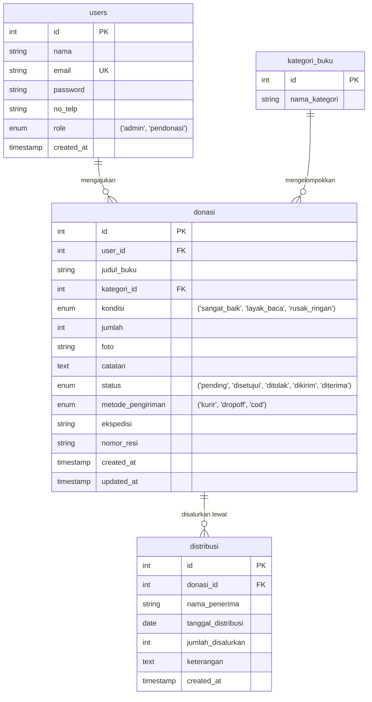

# BukuBerbagi - Sistem Pendonasian Buku Fisik

BukuBerbagi adalah platform berbasis web untuk memfasilitasi pendonasian buku fisik secara online oleh masyarakat umum (Pendonasi), yang selanjutnya diverifikasi dan disalurkan secara offline ke sekolah-sekolah, panti asuhan, perpustakaan jalanan, maupun individu/orang umum yang membutuhkan oleh pengelola (Admin).

---

## 🛠️ Tech Stack & Prasyarat
* **Bahasa & Logika**: PHP Native (v8.x didukung)
* **CSS & Layout**: Bootstrap 5 (via CDN untuk CSS) & Custom CSS murni
* **JavaScript**: Vanilla JS (Pustaka JS Bootstrap 5 telah dilepas sepenuhnya; seluruh dialog pesan sukses/eror dikelola menggunakan fungsi `alert()` murni Vanilla JS)
* **Database**: MySQL

---

## 📂 Struktur Direktori Proyek
```text
tubes/
├── assets/                 # CSS murni kustom, JS, dan gambar
│   ├── css/
│   │   └── style.css       # Desain global kustom
│   ├── js/
│   │   └── main.js         # Interaksi JS murni
│   └── uploads/            # Folder upload foto buku dari pendonasi
├── config/                 # Pengaturan sistem & database
│   └── database.php        # File koneksi PDO MySQL (Auto-deteksi localhost & InfinityFree)
├── includes/               # Komponen template berulang
│   ├── header.php          # Navbar & load Google Fonts & CSS (Navigasi dinamis berbasis peran)
│   ├── footer.php          # Footer & load JS (Bootstrap JS dilepas)
│   └── session.php         # File helper session terpusat yang aman (HttpOnly, SameSite, Secure, Lifetime=0)
├── views/                  # Halaman spesifik role
│   ├── admin/              # Panel dashboard admin & manajemen data
│   │   ├── dashboard.php       # Dashboard utama statistik donasi
│   │   ├── detail_donasi.php   # Tinjau foto kelayakan buku, setujui, tolak, terima paket
│   │   ├── distribusi.php      # Pencatatan log distribusi offline baru & riwayat log
│   │   ├── edit_distribusi.php # Form edit log distribusi (kalkulasi stok dinamis)
│   │   ├── hapus_distribusi.php# Skrip hapus log distribusi (kalkulasi stok dinamis)
│   │   ├── kategori.php        # Halaman kelola kategori buku (tambah baru)
│   │   ├── edit_kategori.php   # Form edit nama kategori buku
│   │   ├── hapus_kategori.php  # Skrip hapus kategori buku (RESTRICT check)
│   │   ├── stok.php            # Inventarisasi stok gudang dinamis
│   │   └── users.php           # Halaman kelola akun pengguna & hapus akun
│   └── pendonasi/          # Panel dashboard pendonasi
│       ├── dashboard.php       # Riwayat donasi & tombol edit/batal pending
│       ├── edit_donasi.php     # Form edit pengajuan donasi pending
│       ├── hapus_donasi.php    # Skrip hapus/batal pengajuan donasi pending
│       ├── kirim_buku.php      # Input nomor resi atau metode Dropoff/COD
│       ├── profil.php          # Halaman edit profil & password pendonasi
│       └── tambah_donasi.php   # Formulir donasi buku baru + upload foto
├── index.php               # Halaman Beranda Utama & Katalog Publik
├── login.php               # Halaman Masuk (Split-screen, dialog JavaScript alert)
├── register.php            # Halaman Daftar Pendonasi (Split-screen, dialog JavaScript alert)
├── logout.php              # Script hapus session
├── setup_db.php            # Script instalasi & seed database otomatis
└── database.sql            # Skema DDL awal database
```

---

## 🚀 Cara Setup Database & Seeder Otomatis

1. Aktifkan server **Apache & MySQL** di Laragon/XAMPP Anda.
2. Pastikan folder proyek diletakkan di dalam folder `www/` (Laragon) atau `htdocs/` (XAMPP).
3. Buka browser Anda dan akses tautan berikut:
   ```text
   http://localhost/tubes/setup_db.php
   ```
4. Script akan otomatis:
   * Membuat database `db_donasi_buku`.
   * Membuat seluruh struktur tabel relasional.
   * Menyuntikkan master kategori buku.
   * Membuat **akun Admin bawaan** dan **3 akun Pendonasi dummy**.
   * Menambahkan **5 sampel donasi** dengan berbagai status (`pending`, `disetujui`, `dikirim`, `diterima`) serta **2 log distribusi** untuk keperluan pengujian.

---

## 📋 Alur Bisnis Pengujian Sistem
1. **Daftar/Masuk**: Masuk menggunakan akun Pendonasi `budi@gmail.com` (password: `budi123`).
2. **Ajukan Donasi**: Klik **Donasikan Buku Baru** -> isi data, unggah foto -> Kirim. (Status donasi awal adalah `Pending`).
3. **Batal/Edit Pengajuan**: Selama donasi berstatus `Pending`, Pendonasi dapat mengklik **Edit** atau **Batal** pada dashboard mereka.
4. **Persetujuan Admin**: Logout, lalu masuk sebagai Admin (`admin@donasibuku.com` | password: `admin123`). Pada dashboard admin, pilih detail donasi budi, klik **Setujui Pengajuan**.
5. **Kirim Buku**: Logout dan masuk kembali sebagai budi. Status donasi budi kini `Disetujui`. Klik **Kirim Buku**, pilih metode kirim (misal: Kurir), isi ekspedisi dan nomor resi, klik Konfirmasi. (Status berubah menjadi `Sedang Dikirim`).
6. **Konfirmasi Fisik**: Masuk kembali sebagai Admin, klik detail donasi budi, klik **Konfirmasi Terima Buku Fisik**. (Status berubah menjadi `Diterima`).
7. **Katalog & Penyaluran**:
   * Buku budi kini otomatis muncul di **Katalog Buku Publik** di halaman depan website ([index.php](index.php)).
   * Di dashboard admin, buka menu **Stok & Inventaris** -> Klik **Salurkan Buku** untuk mencatat pendistribusian buku tersebut secara offline ke penerima target.
8. **Koreksi Distribusi**: Pada halaman Distribusi, Admin dapat mengedit atau menghapus log distribusi. Sisa stok di gudang otomatis dikalkulasi ulang secara dinamis.
9. **Kelola Kategori**: Admin dapat membuka menu **Kategori** untuk menambah, mengedit, atau menghapus kategori buku. (Penghapusan dicegah jika kategori masih dikaitkan dengan buku donasi).
10. **Kelola Pengguna**: Admin dapat membuka menu **Pengguna** untuk melihat seluruh pengguna terdaftar dan menghapus akun Pendonasi.

---

## 👥 Peran Pengguna (User Roles)

Sistem ini memiliki dua peran utama dengan akses dan tugas yang berbeda:

*   **Pendonasi (Donator)**:
    *   Mendaftarkan akun secara mandiri.
    *   Mengajukan donasi buku baru dengan mengisi detail buku.
    *   Melacak status donasi yang diajukan.
    *   Mengedit atau menghapus donasi jika statusnya masih `pending`.
    *   Menginput informasi pengiriman setelah donasi disetujui.
    *   Memperbarui profil nama, nomor telepon, dan password mandiri.
*   **Admin**:
    *   Mengurasi/memvalidasi usulan donasi dari pendonasi (menyetujui atau menolak).
    *   Mengonfirmasi penerimaan fisik buku berdasarkan informasi pengiriman.
    *   Menginventarisasi stok buku yang telah berstatus "Diterima".
    *   Mencatat, memperbarui, dan menghapus log penyaluran buku secara offline ke penerima.
    *   Mengelola master kategori buku (menambah, mengubah nama, menghapus).
    *   Mengelola akun pengguna (melihat daftar dan menghapus akun pendonasi).

---

## 🔄 Siklus Hidup & Status Donasi (Donation Status Lifecycle)

Buku yang didonasikan melewati beberapa tahap perubahan status. Berikut adalah diagram alir status donasi dari pengajuan hingga penyaluran:


---

## 📊 Struktur Database & Hubungan Relasional (ERD)

Database `db_donasi_buku` terdiri dari 4 tabel utama dengan relasi sebagai berikut:



---

## 🗺️ Hubungan Antar-File & Struktur Program

Berikut adalah peta interaksi antar-file PHP saat pengguna menggunakan sistem BukuBerbagi:

```mermaid
graph TD
    %% Entry Points
    index.php["index.php (Landing Page & Katalog Publik)"]
    login.php["login.php (Autentikasi)"]
    register.php["register.php (Registrasi Pendonasi)"]
    logout.php["logout.php (Destroy Session)"]
    
    %% Config & Includes
    db_config["config/database.php (PDO Connection)"]
    session_config["includes/session.php (Secure Session Helper)"]
    header["includes/header.php (Navbar & CSS)"]
    footer["includes/footer.php (JS & Footer)"]
    
    %% Views Donator
    subgraph Views_Pendonasi [Dashboard Pendonasi]
        dashboard_p["views/pendonasi/dashboard.php"]
        tambah_d["views/pendonasi/tambah_donasi.php"]
        edit_d["views/pendonasi/edit_donasi.php"]
        hapus_d["views/pendonasi/hapus_donasi.php"]
        kirim_b["views/pendonasi/kirim_buku.php"]
        profil_p["views/pendonasi/profil.php"]
    end
    
    %% Views Admin
    subgraph Views_Admin [Dashboard Admin]
        dashboard_a["views/admin/dashboard.php"]
        detail_d["views/admin/detail_donasi.php"]
        stok_a["views/admin/stok.php"]
        distribusi_a["views/admin/distribusi.php"]
        edit_dist["views/admin/edit_distribusi.php"]
        hapus_dist["views/admin/hapus_distribusi.php"]
        kategori_a["views/admin/kategori.php"]
        edit_kat["views/admin/edit_kategori.php"]
        hapus_kat["views/admin/hapus_kategori.php"]
        users_a["views/admin/users.php"]
    end

    %% Relations & Flow
    index.php --> login.php
    login.php --> register.php
    register.php --> login.php
    
    login.php -- Redirect sesuai role --> dashboard_p
    login.php -- Redirect sesuai role --> dashboard_a
    
    %% Pendonasi Flow
    dashboard_p --> tambah_d
    dashboard_p --> edit_d
    dashboard_p --> hapus_d
    dashboard_p --> kirim_b
    dashboard_p --> profil_p
    
    %% Admin Flow
    dashboard_a --> detail_d
    dashboard_a --> stok_a
    dashboard_a --> kategori_a
    dashboard_a --> users_a
    stok_a --> distribusi_a
    distribusi_a --> edit_dist
    distribusi_a --> hapus_dist
    kategori_a --> edit_kat
    kategori_a --> hapus_kat
    
    %% Global inclusions
    dashboard_p & tambah_d & edit_d & hapus_d & kirim_b & profil_p -.-> db_config
    dashboard_a & detail_d & stok_a & distribusi_a & edit_dist & hapus_dist & kategori_a & edit_kat & hapus_kat & users_a -.-> db_config
    
    dashboard_p & tambah_d & edit_d & hapus_d & kirim_b & profil_p -.-> header
    dashboard_a & detail_d & stok_a & distribusi_a & edit_dist & hapus_dist & kategori_a & edit_kat & hapus_kat & users_a -.-> header
    
    dashboard_p & tambah_d & edit_d & hapus_d & kirim_b & profil_p -.-> footer
    dashboard_a & detail_d & stok_a & distribusi_a & edit_dist & hapus_dist & kategori_a & edit_kat & hapus_kat & users_a -.-> footer
    
    header & login.php & register.php & logout.php -.-> session_config
```



---

## 🔒 Fitur Keamanan Terintegrasi (Session & Cookie)

Aplikasi ini menggunakan manajemen session dan cookie terpusat yang telah diperkuat terhadap berbagai celah keamanan web:
* **Masa Berlaku Sesi Terbatas (Lifetime = 0):** Sesi login dan cookie secara otomatis dihapus dari browser ketika pengguna menutup seluruh jendela aplikasi browser. Pengguna wajib melakukan login ulang untuk masuk kembali.
* **HttpOnly Cookie Flag:** Mengamankan cookie session ID (`PHPSESSID`) sehingga tidak bisa diakses oleh skrip di sisi klien (melindungi dari pencurian sesi lewat serangan XSS).
* **SameSite Lax Flag:** Melindungi aplikasi dari serangan *Cross-Site Request Forgery* (CSRF) dengan membatasi transmisi cookie pada permintaan lintas situs.
* **Auto-Secure Flag (HTTPS/HTTP):** Cookie session secara dinamis mendeteksi penggunaan HTTPS untuk memastikan session ID hanya ditransmisikan melalui saluran terenkripsi jika berjalan di produksi.
* **Regenerasi Session ID:** Meregenerasi ID session setiap kali status login berubah (pada proses `login.php` dan `register.php`), sehingga mencegah serangan *Session Fixation*.
* **Force Cookie Expiry saat Logout:** Menghapus data sesi dan secara aktif memaksa masa berlaku cookie session di browser menjadi lampau untuk memastikan pembersihan total.
