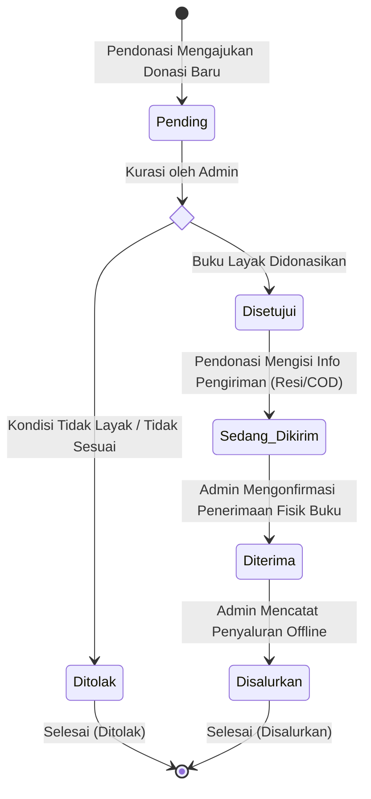
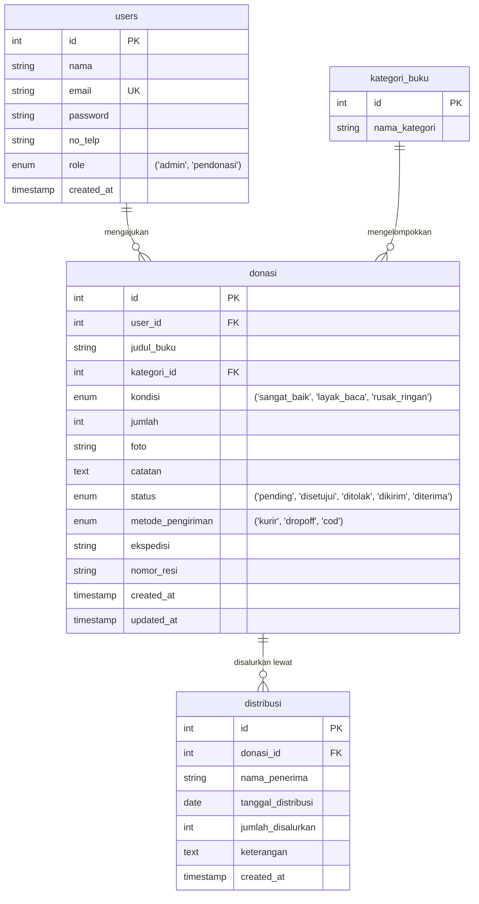
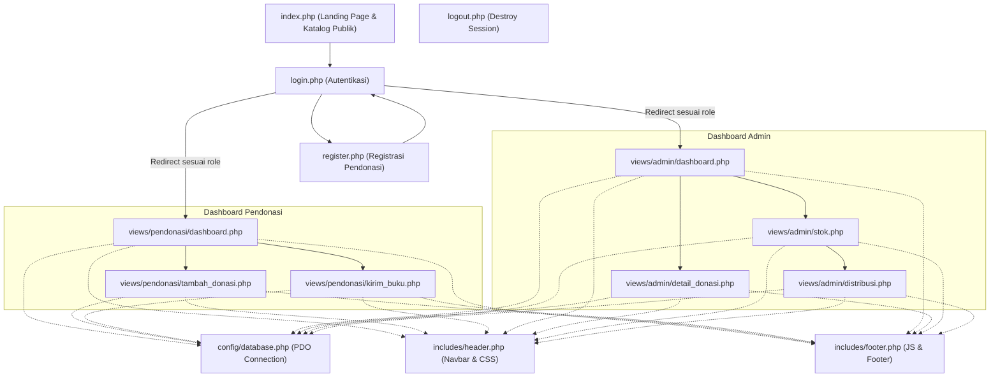

# BukuBerbagi - Sistem Pendonasian Buku Fisik

BukuBerbagi adalah platform berbasis web untuk memfasilitasi pendonasian buku fisik secara online oleh masyarakat umum (Pendonasi), yang selanjutnya diverifikasi dan disalurkan secara offline ke sekolah-sekolah, panti asuhan, perpustakaan jalanan, maupun individu/orang umum yang membutuhkan oleh pengelola (Admin).

---

## 🛠️ Tech Stack & Prasyarat
* **Bahasa & Logika**: PHP Native (v8.x didukung)
* **CSS & Layout**: Bootstrap 5 (via CDN) & Custom CSS murni
* **JavaScript**: Vanilla JS
* **Database**: MySQL

---

## 📂 Struktur Direktori Proyek
```text
tubes/
├── assets/                 # CSS murni kustom, JS, dan gambar
│   ├── css/
│   │   └── style.css       # Desain global kustom
│   ├── js/
│   │   └── main.js         # Interaksi JS murni
│   └── uploads/            # Folder upload foto buku dari pendonasi
├── config/                 # Pengaturan sistem & database
│   └── database.php        # File koneksi PDO MySQL
├── includes/               # Komponen template berulang
│   ├── header.php          # Navbar & load Google Fonts & CSS
│   └── footer.php          # Footer & load JS
├── views/                  # Halaman spesifik role
│   ├── admin/              # Panel dashboard kurasi & distribusi admin
│   └── pendonasi/          # Panel dashboard donasi & resi pendonasi
├── index.php               # Halaman Beranda Utama & Katalog Publik
├── login.php               # Halaman Masuk (Split-screen)
├── register.php            # Halaman Daftar Pendonasi (Split-screen)
├── logout.php              # Script hapus session
├── setup_db.php            # Script instalasi & seed database otomatis
└── database.sql            # Skema DDL awal database
```

---

## 🚀 Cara Setup Database & Seeder Otomatis

1. Aktifkan server **Apache & MySQL** di Laragon/XAMPP Anda.
2. Pastikan folder proyek diletakkan di dalam folder `www/` (Laragon) atau `htdocs/` (XAMPP).
3. Buka browser Anda dan akses tautan berikut:
   ```text
   http://localhost/tubes/setup_db.php
   ```
4. Script akan otomatis:
   * Membuat database `db_donasi_buku`.
   * Membuat seluruh struktur tabel relasional.
   * Menyuntikkan master kategori buku.
   * Membuat **akun Admin bawaan** dan **3 akun Pendonasi dummy**.
   * Menambahkan **5 sampel donasi** dengan berbagai status (`pending`, `disetujui`, `dikirim`, `diterima`) serta **2 log distribusi** untuk keperluan pengujian.

---

## 📋 Alur Bisnis Pengujian Sistem
1. **Daftar/Masuk**: Masuk menggunakan akun Pendonasi `budi@gmail.com`.
2. **Ajukan Donasi**: Klik **Donasikan Buku Baru** -> isi data, unggah foto -> Kirim. (Status donasi awal adalah `Pending`).
3. **Persetujuan Admin**: Logout, lalu masuk sebagai Admin (`admin@gmail.com`). Pada dashboard admin, pilih detail donasi budi, klik **Setujui Pengajuan**.
4. **Kirim Buku**: Logout dan masuk kembali sebagai budi. Status donasi budi kini `Disetujui`. Klik **Kirim Buku**, pilih metode kirim (misal: Kurir), isi ekspedisi dan nomor resi, klik Konfirmasi. (Status berubah menjadi `Sedang Dikirim`).
5. **Konfirmasi Fisik**: Masuk kembali sebagai Admin, klik detail donasi budi, klik **Konfirmasi Terima Buku Fisik**. (Status berubah menjadi `Diterima`).
6. **Katalog & Penyaluran**:
   * Buku budi kini otomatis muncul di **Katalog Buku Publik** di halaman depan website ([index.php](index.php)).
   * Di dashboard admin, buka menu **Stok & Inventaris** -> Klik **Salurkan Buku** untuk mencatat pendistribusian buku tersebut secara offline ke penerima target.

---

## 👥 Peran Pengguna (User Roles)

Sistem ini memiliki dua peran utama dengan akses dan tugas yang berbeda:

*   **Pendonasi (Donator)**:
    *   Mendaftarkan akun secara mandiri.
    *   Mengajukan donasi buku baru dengan mengisi detail buku (judul, kategori, kondisi, jumlah, dan foto).
    *   Melacak status donasi yang diajukan.
    *   Menginput informasi pengiriman (kurir & nomor resi, drop-off langsung, atau COD) setelah donasi disetujui.
*   **Admin**:
    *   Mengurasi/memvalidasi usulan donasi dari pendonasi (menyetujui atau menolak).
    *   Mengonfirmasi penerimaan fisik buku berdasarkan informasi pengiriman.
    *   Mengelola stok buku yang telah berstatus "Diterima".
    *   Mencatat penyaluran buku secara offline ke penerima (sekolah, perpustakaan jalanan, komunitas baca, panti asuhan, maupun perorangan/umum).

---

## 🔄 Siklus Hidup & Status Donasi (Donation Status Lifecycle)

Buku yang didonasikan melewati beberapa tahap perubahan status. Berikut adalah diagram alir status donasi dari pengajuan hingga penyaluran:



---

## 📝 Detail Alur Bisnis Step-by-Step

Proses pendonasian buku fisik secara terperinci berjalan sebagai berikut:

### Langkah 1: Registrasi & Autentikasi
1. Pengguna umum mendaftar melalui halaman `register.php`.
2. Setelah berhasil terdaftar, pengguna masuk melalui `login.php`.
3. Sistem mendeteksi `role` pengguna (`admin` atau `pendonasi`) berdasarkan data di database dan mengarahkan ke dashboard masing-masing.

### Langkah 2: Pengajuan Donasi (Pendonasi)
1. Pendonasi membuka halaman **Donasikan Buku Baru** (`views/pendonasi/tambah_donasi.php`).
2. Pendonasi mengisi formulir (Judul Buku, Kategori, Kondisi, Jumlah Buku, Catatan) dan mengunggah **Foto Buku**.
3. Data donasi disimpan di tabel `donasi` dengan status awal **`pending`**.

### Langkah 3: Verifikasi & Kurasi (Admin)
1. Admin masuk ke dashboard admin (`views/admin/dashboard.php`) dan melihat daftar donasi berstatus `pending`.
2. Admin membuka halaman detail donasi (`views/admin/detail_donasi.php`) untuk memeriksa foto dan kelayakan buku.
3. Admin memilih aksi:
   * **Setujui**: Mengubah status donasi menjadi **`disetujui`**.
   * **Tolak**: Mengubah status donasi menjadi **`ditolak`** (proses selesai dengan penolakan).

### Langkah 4: Pengiriman Buku (Pendonasi)
1. Pendonasi melihat pembaruan status di dashboard-nya. Jika statusnya **`disetujui`**, tombol **Kirim Buku** akan aktif.
2. Pendonasi membuka halaman pengiriman (`views/pendonasi/kirim_buku.php`) dan memilih metode pengiriman:
   * **Kurir**: Mengisi nama ekspedisi dan nomor resi pengiriman.
   * **Drop-off / COD**: Mengisi detail rencana penyerahan fisik langsung ke lokasi drop-off.
3. Setelah data disimpan, status donasi berubah menjadi **`dikirim`**.

### Langkah 5: Konfirmasi Penerimaan Fisik (Admin)
1. Setelah paket buku sampai di alamat Admin, Admin membuka dashboard dan memeriksa detail donasi terkait.
2. Admin mencocokkan nomor resi/data pengiriman dan menekan tombol **Konfirmasi Terima Buku Fisik**.
3. Status donasi diperbarui menjadi **`diterima`**.
4. Buku yang berstatus **`diterima`** otomatis masuk ke dalam **Stok & Inventaris** sistem dan akan ditampilkan pada **Katalog Buku Publik** di halaman utama (`index.php`) agar masyarakat dapat melihat ketersediaan buku tersebut.

### Langkah 6: Penyaluran Offline (Admin)
1. Admin membuka halaman **Stok & Inventaris** (`views/admin/stok.php`).
2. Admin memilih buku yang ingin disalurkan secara offline dan menekan tombol **Salurkan Buku** (`views/admin/distribusi.php`).
3. Admin mengisi nama instansi/komunitas/orang umum penerima, tanggal penyaluran, jumlah buku yang disalurkan, dan keterangan tambahan.
4. Sistem mencatat log transaksi ke tabel `distribusi` dan mengurangi jumlah/mengupdate status stok donasi yang bersangkutan jika seluruh stoknya telah disalurkan.

---

## 📊 Struktur Database & Hubungan Relasional (ERD)

Database `db_donasi_buku` terdiri dari 4 tabel utama dengan relasi sebagai berikut:



---

## 🗺️ Hubungan Antar-File & Struktur Program

Berikut adalah peta interaksi antar-file PHP saat pengguna menggunakan sistem BukuBerbagi:



*Keterangan: Garis putus-putus menunjukkan file tersebut mengikutsertakan (include) konfigurasi database atau template layout header & footer.*
